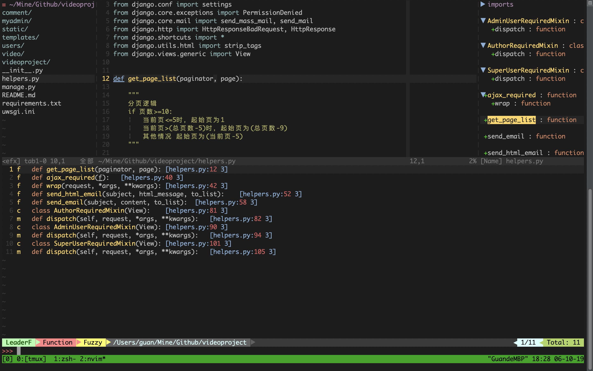

# 效果

没有效果图的 nvim 配置都是耍流氓。




# 说明

这是为新手准备的 nvim 配置。当然，暂时还不能完全投入使用，其操作手册也会在后续有空时奉上。

# 使用

1. 安装 vim-plug。终端执行以下：
```bash
curl -fLo ~/.local/share/nvim/site/autoload/plug.vim --create-dirs \
             https://raw.githubusercontent.com/junegunn/vim-plug/master/plug.vim
```

2. 安装 nodejs：
```bash
curl -o- https://raw.githubusercontent.com/creationix/nvm/v0.34.0/install.sh | bash

source ~/.bashrc

NVM_NODEJS_ORG_MIRROR=https://npm.taobao.org/mirrors/node nvm install node
```

3. 替换 init.vim：
```bash
# 如果不存在 init.vim
mkdir -p ~/.config/nvim
mv init.vim ~/.config/nvim

# 如果存在 init.vim
mv ~/.config/nvim/init.vim ~/.config/nvim/init.vim.bak
mv init.vim ~/.config/nvim
```

# 操作手册
TODO
